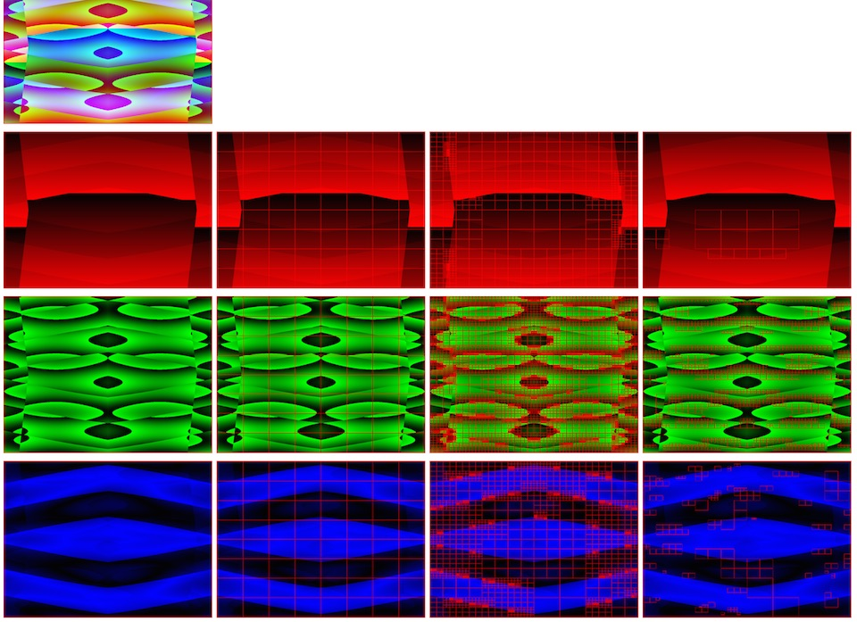
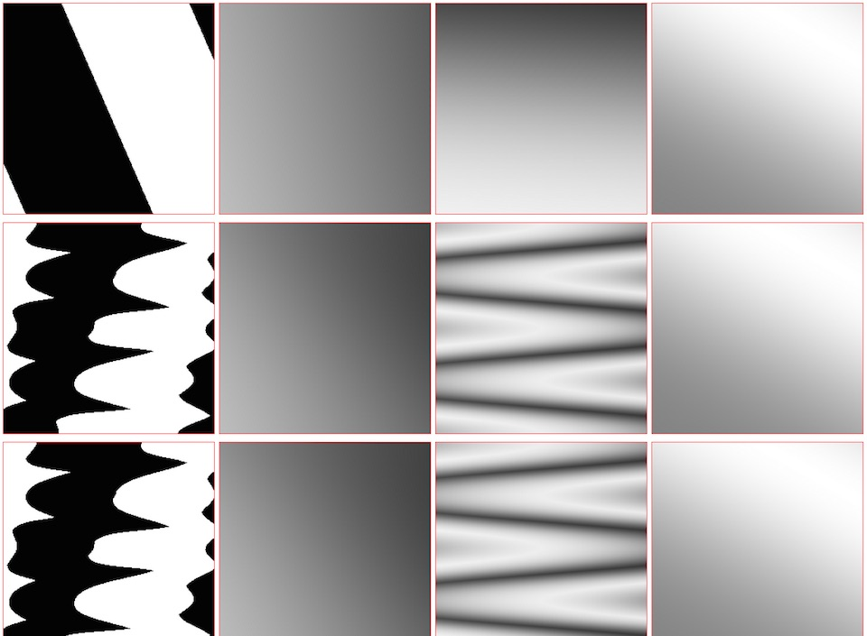
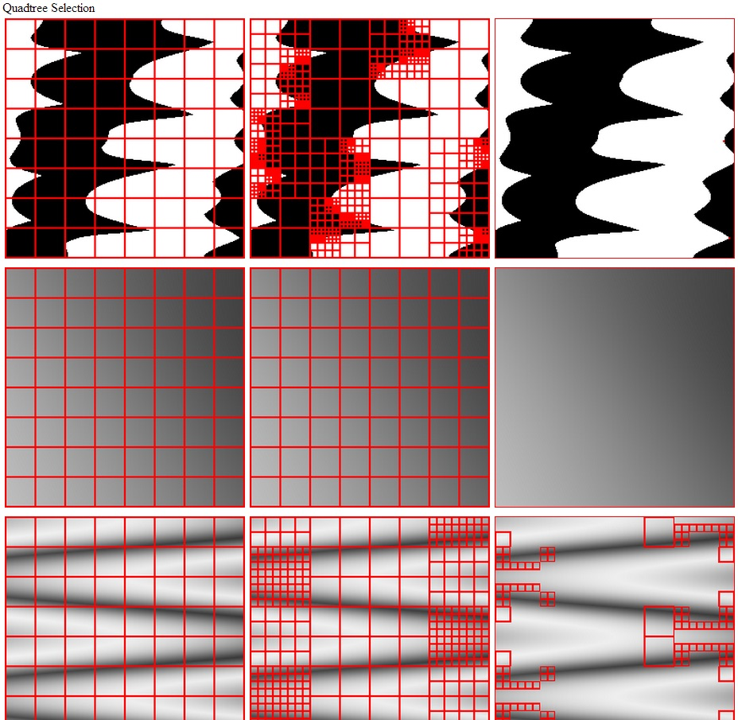

# EA-CPPN-NEAT

Encounter Architect (EA-CPPN-NEAT)

An AI that evolves several CPPN-NEAT graphs to architext various encounters within a game world.

This is a previous grad school AI project written in early 2013 that seems to have lost its previous public repository. I'm adding it back now here.

